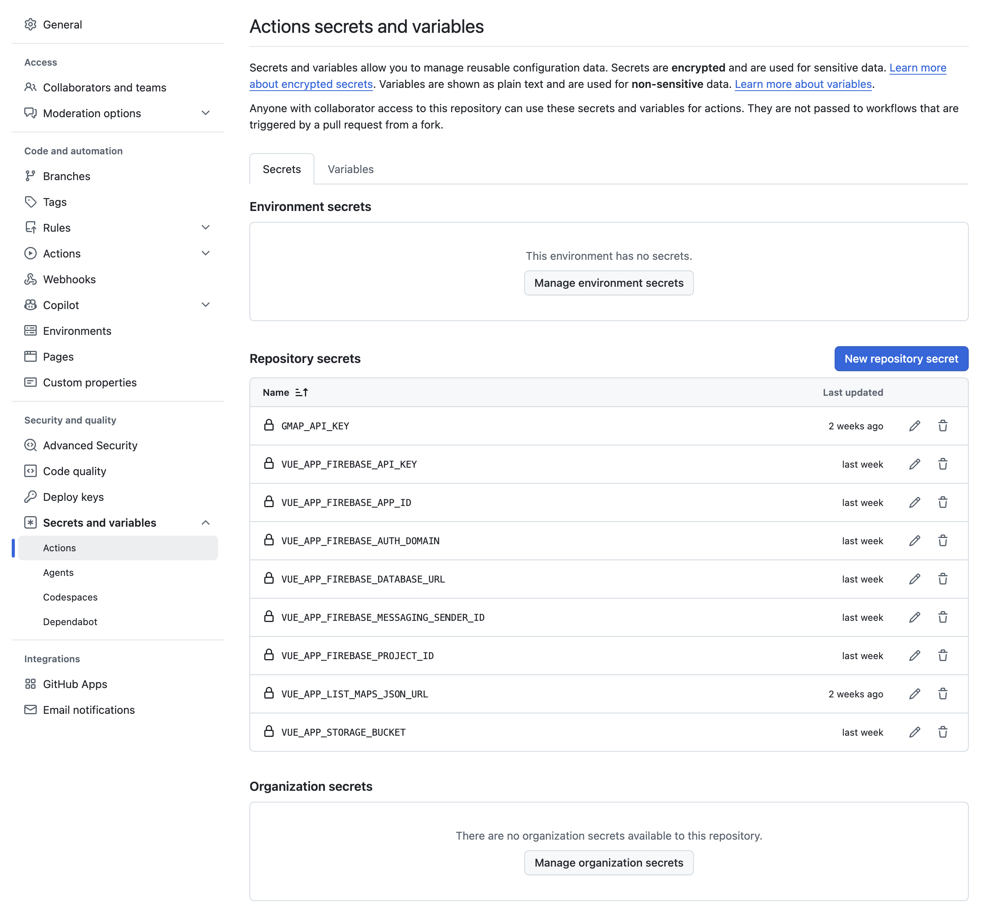

# GitHub Pages Setup for map-detective

GeoGuess クローン「map-detective」をGitHub Pagesでホスティングする場合、Google Maps APIキーやFirebase関連の情報については、該当リポジトリのRepositry Secretsへの設定が必要です。ここで設定された内容は、GitHub Actionsでのビルド時に参照されます。

1. [Firebase](FIREBASE_SETUP.md)と[Google Maps](GOOGLE_MAPS_SETUP.md)でAPIキーなどを取得します。
2. リポジトリの[Actions secrets and variables](https://github.com/map-detective/map-detective.github.io/settings/secrets/actions)にアクセスします。
3. Repository secretsの[New repositry secret]を押して、キーと値を追加していきます。

|Repositry secretのキー|値|
|:--|:--|
|GMAP_API_KEY|Google Maps APIキー|

|Repositry secretのキー|対応するFirebaseのキー|
|:--|:--|
|VUE_APP_FIREBASE_API_KEY|apiKey|
|VUE_APP_FIREBASE_AUTH_DOMAIN|authDomain|
|VUE_APP_FIREBASE_DATABASE_URL|databaseURL|
|VUE_APP_FIREBASE_PROJECT_ID|projectId|
|VUE_APP_STORAGE_BUCKET|storageBucket|
|VUE_APP_FIREBASE_MESSAGING_SENDER_ID|messagingSenderId|
|VUE_APP_FIREBASE_APP_ID|appId|
|VUE_APP_LIST_MAPS_JSON_URL|'https://maps.geoguess.games/maps.json'|

さらに、Realtime Database のセキュリティルールと、ルームの自動削除のために以下を登録します。

|Repositry secretのキー|値|
|:--|:--|
|FIREBASE_ALLOWED_DOMAIN|ルームを作成できる Google アカウント。カンマ区切りで複数指定可（例: `@example.com`）|

`FIREBASE_ALLOWED_DOMAIN` は、セキュリティルールの生成に加えて、アプリのビルド時に `VUE_APP_ALLOWED_ACCOUNTS` として渡され、ログイン直後の確認にも使われます。

|FIREBASE_SERVICE_ACCOUNT|サービスアカウントの秘密鍵 JSON の中身をそのまま貼り付け|

`FIREBASE_SERVICE_ACCOUNT` は、Firebase コンソールの「プロジェクトの設定 > サービスアカウント > 新しい秘密鍵を生成」で取得します。ダウンロードした JSON ファイルはリポジトリに置かず、Secret に貼り付けたら破棄してください。

これらの Secret は、以下のワークフローで使われます。

|ワークフロー|内容|
|:--|:--|
|Deploy Database Rules|セキュリティルールを生成して Firebase に反映|
|Clean Rooms|1 日以上経過したルームを毎日削除|

詳しくは [Firebase セットアップ手順](FIREBASE_SETUP.md) を参照してください。

`VUE_APP_LIST_MAPS_JSON_URL`はゲームで利用するMAPカタログデータで、'https://maps.geoguess.games/maps.json'を指定すれば良いようです（おそらく、自作も可能）。

参考：[Maps json](MapsJson.md)

Firebaseの管理画面で取得できる値との対応付けは以下の通りです。

```js
// Your web app's Firebase configuration
const firebaseConfig = {
  apiKey: "VUE_APP_FIREBASE_API_KEY",
  authDomain: "VUE_APP_FIREBASE_AUTH_DOMAIN",
  databaseURL: "VUE_APP_FIREBASE_DATABASE_URL",
  projectId: "VUE_APP_FIREBASE_PROJECT_ID",
  storageBucket: "VUE_APP_STORAGE_BUCKET",
  messagingSenderId: "VUE_APP_FIREBASE_MESSAGING_SENDER_ID",
  appId: "VUE_APP_FIREBASE_APP_ID"
};
```


